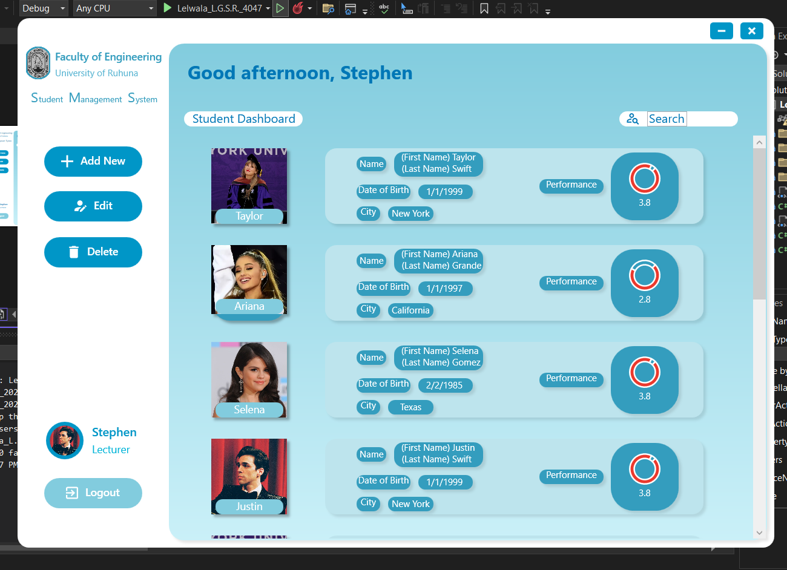

# Student Management System using WPF (C#)

This project is a Student Management System developed during the 2nd year of university. It utilizes Windows Presentation Foundation (WPF) and C# programming language to create a graphical user interface for managing student information.

## Description

The Student Management System allows users to perform various operations related to student management, including adding, editing, and viewing student details. It provides a user-friendly interface for teachers or administrators to efficiently manage student records.

## Screenshots

*Dashboard*

## Usage

To use the Student Management System, follow these steps:

1. Clone the repository to your local machine.
2. Open the project in Visual Studio or your preferred C# IDE.
3. Compile and run the application.
4. Use the provided functionalities to add, edit, or view student details.

## Contribution

Contributions to improve this project are welcome! You can contribute by:

- Reporting bugs or suggesting enhancements by creating issues.
- Providing feedback on usability, design, or features.
- Forking the repository and submitting pull requests with your changes.

If you encounter any issues or have ideas for improvement, feel free to open an issue to discuss them. Your input is valuable in making this project better!
